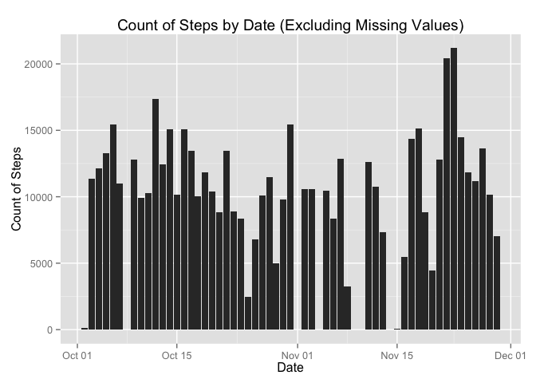
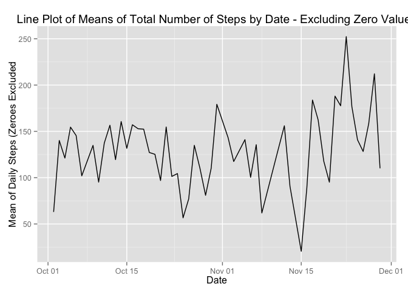
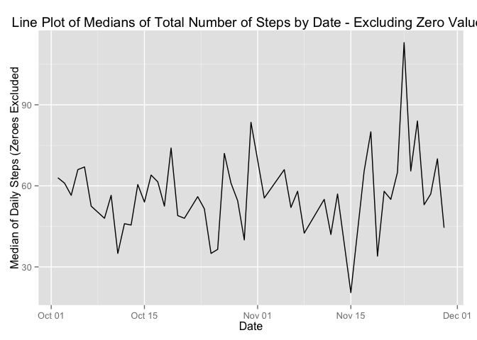
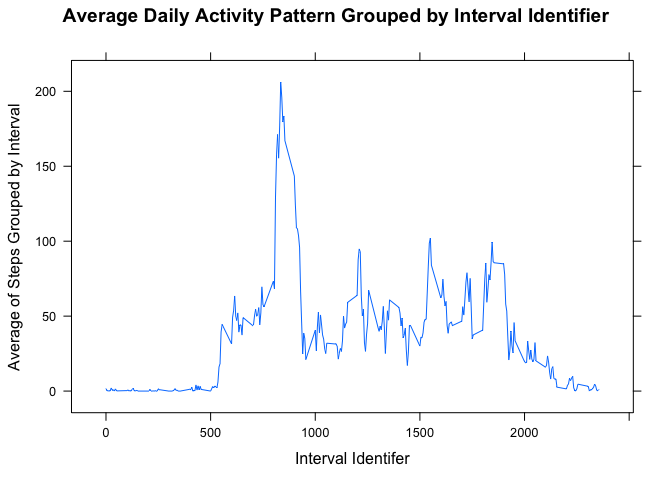
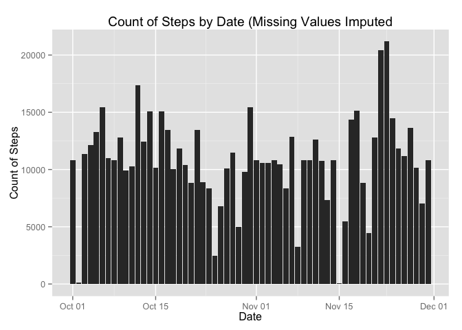
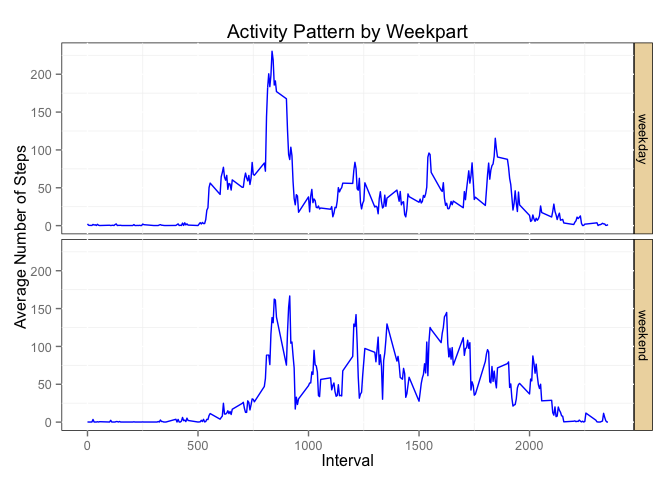

# Reproducible Research: Peer Assessment 1

## Housekeeping

Clear Environment and Console


```r
rm(list=ls())
cat('\014')
```

packageR is a function used to install R Packages.<br />
packageR is invoked, and packages installed, only when needed


```r
packageR <- function(pkg){
     if (!require(pkg,character.only = TRUE))
     {
          install.packages(pkg,dep=TRUE)
          if(!require(pkg,character.only = TRUE)) {
               stop("Package not found")
          } else {
               library(pkg,character.only=TRUE)
          }
     }
}

packageR("datasets")
packageR("ProjectTemplate")
```

```
## Loading required package: ProjectTemplate
```

```r
packageR("ggplot2")
```

```
## Loading required package: ggplot2
```

```r
packageR("ggthemes")
```

```
## Loading required package: ggthemes
```

```r
packageR("lattice")
```

```
## Loading required package: lattice
```

```r
packageR("scales")
```

```
## Loading required package: scales
```

```r
packageR("rmarkdown")
```

```
## Loading required package: rmarkdown
```

```r
packageR("data.table")
```

```
## Loading required package: data.table
```

```r
packageR("sqldf")
```

```
## Loading required package: sqldf
## Loading required package: gsubfn
## Loading required package: proto
## Loading required package: RSQLite
## Loading required package: DBI
```

```r
packageR("dplyr")
```

```
## Loading required package: dplyr
## 
## Attaching package: 'dplyr'
## 
## The following objects are masked from 'package:data.table':
## 
##     between, last
## 
## The following object is masked from 'package:stats':
## 
##     filter
## 
## The following objects are masked from 'package:base':
## 
##     intersect, setdiff, setequal, union
```

```r
packageR("lubridate")
```

```
## Loading required package: lubridate
## 
## Attaching package: 'lubridate'
## 
## The following objects are masked from 'package:data.table':
## 
##     hour, mday, month, quarter, wday, week, yday, year
```

```r
packageR("sqldf")
packageR("Hmisc")
```

```
## Loading required package: Hmisc
## Loading required package: grid
## Loading required package: survival
## Loading required package: Formula
## 
## Attaching package: 'Hmisc'
## 
## The following objects are masked from 'package:dplyr':
## 
##     combine, src, summarize
## 
## The following objects are masked from 'package:base':
## 
##     format.pval, round.POSIXt, trunc.POSIXt, units
```

```r
packageR("knitr")
```

```
## Loading required package: knitr
```

pathR is a function to simplify multi-device development.<br />
pathR is used to set 'path_to_data' as appropriate for my machines


```r
pathR <- function(machine,course){
     machine.path <- "/Users/rickwrites/Dropbox/Data-Science/Coursera/"
     if(machine != "iMac"){
          machine.path <- "/Users/Rick/Dropbox/Data-Science/Coursera/"
     }
     paste(machine.path,course,sep="")
}

getwd()
course <- "DS-05-Reproducible/RepData_PeerAssessment1"
working.directory <- pathR('iMac',course)
setwd(working.directory) ## Make it so, Number One (set the Working Directory to the applicable path for current machine)
getwd()
```

Configure key parameters for knitr


```r
opts_chunk$set(echo = TRUE, cache = TRUE, cache.path = "cache/", fig.path = "figure/")
```

## Loading and preprocessing the data<br />
1. Load the data (<b>Note:</b> Because <b>data.table</b> is being used, fread, not read.csv, is used to populate the dataframe)


```r
csv.name <- "activity.csv"

if (!file.exists(csv.name)){
     unzip("activity.zip")
}

dt.activity <- fread("activity.csv",na.strings=(c("NA")))
```

2. Process/transform the data (if necessary) into a format suitable for your analysis<br />
2.a Coerce 'date' from Chr into Date data type (interesting finding: POSIX dates don't work)<br />
2.b Coerce 'steps' from Int into Numeric to ensure it works with median function, later


```r
dt.activity$date <- as.Date(dt.activity$date)
dt.activity$steps <- as.numeric(dt.activity$steps)
```

Verify data.table and conversions


```r
print(str(dt.activity))
```

```
## Classes 'data.table' and 'data.frame':	17568 obs. of  3 variables:
##  $ steps   : num  NA NA NA NA NA NA NA NA NA NA ...
##  $ date    : Date, format: "2012-10-01" "2012-10-01" ...
##  $ interval: int  0 5 10 15 20 25 30 35 40 45 ...
##  - attr(*, ".internal.selfref")=<externalptr> 
## NULL
```

```r
print(nrow(dt.activity))
```

```
## [1] 17568
```

```r
head(dt.activity,20)
```

```
##     steps       date interval
##  1:    NA 2012-10-01        0
##  2:    NA 2012-10-01        5
##  3:    NA 2012-10-01       10
##  4:    NA 2012-10-01       15
##  5:    NA 2012-10-01       20
##  6:    NA 2012-10-01       25
##  7:    NA 2012-10-01       30
##  8:    NA 2012-10-01       35
##  9:    NA 2012-10-01       40
## 10:    NA 2012-10-01       45
## 11:    NA 2012-10-01       50
## 12:    NA 2012-10-01       55
## 13:    NA 2012-10-01      100
## 14:    NA 2012-10-01      105
## 15:    NA 2012-10-01      110
## 16:    NA 2012-10-01      115
## 17:    NA 2012-10-01      120
## 18:    NA 2012-10-01      125
## 19:    NA 2012-10-01      130
## 20:    NA 2012-10-01      135
```

## What is mean total number of steps taken per day?
Note from Instructions: <i>"...ignore the missing values in the dataset"</i><br />
1. Calculate the total number of steps taken per day (this can be accomplished with 'stat_summary', as shown below)<br />
2. Make a histogram of the total number of steps taken each day


```r
p.1 <- ggplot(data = na.exclude(dt.activity), aes(x = date, y = steps))
p.1 <- p.1 + stat_summary(fun.y = sum, geom = "histogram")
p.1 <- p.1 + ggtitle("Count of Steps by Date (Excluding Missing Values)") + ylab("Count of Steps") + xlab("Date")

print(p.1)
```

 

3. Calculate and report the mean and median of the total number of steps taken per day<br />
<b>IMPORTANT NOTE:</b> Because '0' steps occur so frequently in the source data--which means the median would be '0'--<br />
This section of the assignment is being conducted with <b>TWO</b> datasets:<br />
One that <b>includes</b> '0' values in mean & median computations, and<br />
A second that <b>excludes</b> '0' values in mean & median computations

First, mean & median with zeroes included


```r
total.steps.by.date <- na.exclude(dt.activity[,lapply(.SD,sum,na.rm=TRUE),by=date,.SDcols='steps'])

mean.of.total.steps.by.date <- na.exclude(dt.activity[,lapply(.SD,mean,na.rm=TRUE),by=date,.SDcols='steps'])
setnames(mean.of.total.steps.by.date,c("date","steps"), c("date","mean_of_steps"))
print(mean.of.total.steps.by.date)
```

```
##           date mean_of_steps
##  1: 2012-10-02     0.4375000
##  2: 2012-10-03    39.4166667
##  3: 2012-10-04    42.0694444
##  4: 2012-10-05    46.1597222
##  5: 2012-10-06    53.5416667
##  6: 2012-10-07    38.2465278
##  7: 2012-10-09    44.4826389
##  8: 2012-10-10    34.3750000
##  9: 2012-10-11    35.7777778
## 10: 2012-10-12    60.3541667
## 11: 2012-10-13    43.1458333
## 12: 2012-10-14    52.4236111
## 13: 2012-10-15    35.2048611
## 14: 2012-10-16    52.3750000
## 15: 2012-10-17    46.7083333
## 16: 2012-10-18    34.9166667
## 17: 2012-10-19    41.0729167
## 18: 2012-10-20    36.0937500
## 19: 2012-10-21    30.6284722
## 20: 2012-10-22    46.7361111
## 21: 2012-10-23    30.9652778
## 22: 2012-10-24    29.0104167
## 23: 2012-10-25     8.6527778
## 24: 2012-10-26    23.5347222
## 25: 2012-10-27    35.1354167
## 26: 2012-10-28    39.7847222
## 27: 2012-10-29    17.4236111
## 28: 2012-10-30    34.0937500
## 29: 2012-10-31    53.5208333
## 30: 2012-11-02    36.8055556
## 31: 2012-11-03    36.7048611
## 32: 2012-11-05    36.2465278
## 33: 2012-11-06    28.9375000
## 34: 2012-11-07    44.7326389
## 35: 2012-11-08    11.1770833
## 36: 2012-11-11    43.7777778
## 37: 2012-11-12    37.3784722
## 38: 2012-11-13    25.4722222
## 39: 2012-11-15     0.1423611
## 40: 2012-11-16    18.8923611
## 41: 2012-11-17    49.7881944
## 42: 2012-11-18    52.4652778
## 43: 2012-11-19    30.6979167
## 44: 2012-11-20    15.5277778
## 45: 2012-11-21    44.3993056
## 46: 2012-11-22    70.9270833
## 47: 2012-11-23    73.5902778
## 48: 2012-11-24    50.2708333
## 49: 2012-11-25    41.0902778
## 50: 2012-11-26    38.7569444
## 51: 2012-11-27    47.3819444
## 52: 2012-11-28    35.3576389
## 53: 2012-11-29    24.4687500
##           date mean_of_steps
```

```r
median.of.total.steps.by.date <- na.exclude(dt.activity[,lapply(.SD,median,na.rm=TRUE),by=date,.SDcols='steps'])
setnames(median.of.total.steps.by.date,c("date","steps"), c("date","median_of_steps"))
print(median.of.total.steps.by.date)
```

```
##           date median_of_steps
##  1: 2012-10-02               0
##  2: 2012-10-03               0
##  3: 2012-10-04               0
##  4: 2012-10-05               0
##  5: 2012-10-06               0
##  6: 2012-10-07               0
##  7: 2012-10-09               0
##  8: 2012-10-10               0
##  9: 2012-10-11               0
## 10: 2012-10-12               0
## 11: 2012-10-13               0
## 12: 2012-10-14               0
## 13: 2012-10-15               0
## 14: 2012-10-16               0
## 15: 2012-10-17               0
## 16: 2012-10-18               0
## 17: 2012-10-19               0
## 18: 2012-10-20               0
## 19: 2012-10-21               0
## 20: 2012-10-22               0
## 21: 2012-10-23               0
## 22: 2012-10-24               0
## 23: 2012-10-25               0
## 24: 2012-10-26               0
## 25: 2012-10-27               0
## 26: 2012-10-28               0
## 27: 2012-10-29               0
## 28: 2012-10-30               0
## 29: 2012-10-31               0
## 30: 2012-11-02               0
## 31: 2012-11-03               0
## 32: 2012-11-05               0
## 33: 2012-11-06               0
## 34: 2012-11-07               0
## 35: 2012-11-08               0
## 36: 2012-11-11               0
## 37: 2012-11-12               0
## 38: 2012-11-13               0
## 39: 2012-11-15               0
## 40: 2012-11-16               0
## 41: 2012-11-17               0
## 42: 2012-11-18               0
## 43: 2012-11-19               0
## 44: 2012-11-20               0
## 45: 2012-11-21               0
## 46: 2012-11-22               0
## 47: 2012-11-23               0
## 48: 2012-11-24               0
## 49: 2012-11-25               0
## 50: 2012-11-26               0
## 51: 2012-11-27               0
## 52: 2012-11-28               0
## 53: 2012-11-29               0
##           date median_of_steps
```

Second, mean & median <b>without</b> zeroes (zeroes excluded)


```r
activity.zeros.as.na.dt <- dt.activity
activity.zeros.as.na.dt[activity.zeros.as.na.dt$steps == 0] <- NA

mean.of.total.steps.by.date.exclude.zeroes <- na.exclude(activity.zeros.as.na.dt[,lapply(.SD,mean,na.rm=TRUE),by=date,.SDcols='steps'])
setnames(mean.of.total.steps.by.date.exclude.zeroes,c("date","steps"), c("date","mean_of_steps"))
print(mean.of.total.steps.by.date.exclude.zeroes)
```

```
##           date mean_of_steps
##  1: 2012-10-02      63.00000
##  2: 2012-10-03     140.14815
##  3: 2012-10-04     121.16000
##  4: 2012-10-05     154.58140
##  5: 2012-10-06     145.47170
##  6: 2012-10-07     101.99074
##  7: 2012-10-09     134.85263
##  8: 2012-10-10      95.19231
##  9: 2012-10-11     137.38667
## 10: 2012-10-12     156.59459
## 11: 2012-10-13     119.48077
## 12: 2012-10-14     160.61702
## 13: 2012-10-15     131.67532
## 14: 2012-10-16     157.12500
## 15: 2012-10-17     152.86364
## 16: 2012-10-18     152.36364
## 17: 2012-10-19     127.19355
## 18: 2012-10-20     125.24096
## 19: 2012-10-21      96.93407
## 20: 2012-10-22     154.71264
## 21: 2012-10-23     101.34091
## 22: 2012-10-24     104.43750
## 23: 2012-10-25      56.63636
## 24: 2012-10-26      77.02273
## 25: 2012-10-27     134.92000
## 26: 2012-10-28     110.17308
## 27: 2012-10-29      80.93548
## 28: 2012-10-30     110.32584
## 29: 2012-10-31     179.23256
## 30: 2012-11-02     143.24324
## 31: 2012-11-03     117.45556
## 32: 2012-11-05     141.06757
## 33: 2012-11-06     100.40964
## 34: 2012-11-07     135.61053
## 35: 2012-11-08      61.90385
## 36: 2012-11-11     132.71579
## 37: 2012-11-12     156.01449
## 38: 2012-11-13      90.56790
## 39: 2012-11-15      20.50000
## 40: 2012-11-16      89.19672
## 41: 2012-11-17     183.83333
## 42: 2012-11-18     162.47312
## 43: 2012-11-19     117.88000
## 44: 2012-11-20      95.14894
## 45: 2012-11-21     188.04412
## 46: 2012-11-22     177.62609
## 47: 2012-11-23     252.30952
## 48: 2012-11-24     176.56098
## 49: 2012-11-25     140.88095
## 50: 2012-11-26     128.29885
## 51: 2012-11-27     158.67442
## 52: 2012-11-28     212.14583
## 53: 2012-11-29     110.10938
##           date mean_of_steps
```

```r
median.of.total.steps.by.date.exclude.zeroes <- na.exclude(activity.zeros.as.na.dt[,lapply(.SD,median,na.rm=TRUE),by=date,.SDcols='steps'])
setnames(median.of.total.steps.by.date.exclude.zeroes,c("date","steps"), c("date","median_of_steps"))
print(median.of.total.steps.by.date.exclude.zeroes)
```

```
##           date median_of_steps
##  1: 2012-10-02            63.0
##  2: 2012-10-03            61.0
##  3: 2012-10-04            56.5
##  4: 2012-10-05            66.0
##  5: 2012-10-06            67.0
##  6: 2012-10-07            52.5
##  7: 2012-10-09            48.0
##  8: 2012-10-10            56.5
##  9: 2012-10-11            35.0
## 10: 2012-10-12            46.0
## 11: 2012-10-13            45.5
## 12: 2012-10-14            60.5
## 13: 2012-10-15            54.0
## 14: 2012-10-16            64.0
## 15: 2012-10-17            61.5
## 16: 2012-10-18            52.5
## 17: 2012-10-19            74.0
## 18: 2012-10-20            49.0
## 19: 2012-10-21            48.0
## 20: 2012-10-22            52.0
## 21: 2012-10-23            56.0
## 22: 2012-10-24            51.5
## 23: 2012-10-25            35.0
## 24: 2012-10-26            36.5
## 25: 2012-10-27            72.0
## 26: 2012-10-28            61.0
## 27: 2012-10-29            54.5
## 28: 2012-10-30            40.0
## 29: 2012-10-31            83.5
## 30: 2012-11-02            55.5
## 31: 2012-11-03            59.0
## 32: 2012-11-05            66.0
## 33: 2012-11-06            52.0
## 34: 2012-11-07            58.0
## 35: 2012-11-08            42.5
## 36: 2012-11-11            55.0
## 37: 2012-11-12            42.0
## 38: 2012-11-13            57.0
## 39: 2012-11-15            20.5
## 40: 2012-11-16            43.0
## 41: 2012-11-17            65.5
## 42: 2012-11-18            80.0
## 43: 2012-11-19            34.0
## 44: 2012-11-20            58.0
## 45: 2012-11-21            55.0
## 46: 2012-11-22            65.0
## 47: 2012-11-23           113.0
## 48: 2012-11-24            65.5
## 49: 2012-11-25            84.0
## 50: 2012-11-26            53.0
## 51: 2012-11-27            57.0
## 52: 2012-11-28            70.0
## 53: 2012-11-29            44.5
##           date median_of_steps
```

Although the assignment does not specify if the mean & median are to be plotted, or not--<br />
Just to be sure: a plot of both the mean & median of total steps by day are included for completness


```r
p.mean <- ggplot(data = na.exclude(mean.of.total.steps.by.date.exclude.zeroes), aes(x = date, y = mean_of_steps))
p.mean <- p.mean + geom_line()
p.mean <- p.mean + ggtitle("Line Plot of Means of Total Number of Steps by Date - Excluding Zero Values") + ylab("Mean of Daily Steps (Zeroes Excluded") + xlab("Date")
print(p.mean)
```

 

```r
p.median <- ggplot(data = na.exclude(median.of.total.steps.by.date.exclude.zeroes), aes(x = date, y = median_of_steps))
p.median <- p.median + geom_line()
p.median <- p.median + ggtitle("Line Plot of Medians of Total Number of Steps by Date - Excluding Zero Values") + ylab("Median of Daily Steps (Zeroes Excluded") + xlab("Date")
print(p.median)
```

 

## What is the average daily activity pattern?

1. Make a time series plot (i.e. type = "l") of the 5-minute interval (x-axis) and the average number of steps taken, averaged across all days (y-axis)<br />
<b>IMPORANT NOTE:</b> The 'interval' varable is in the form of [#]hmm; that is: [0]155 is Hour 1, Minute 55; which is followed by [0]200, or Hour 2, Minute 00.,br />
First step is to use the <b>sqldf</b> package to group the active data.table by the interval identifier, then average it


```r
sql.select <- "select interval, avg(steps) as avg_steps from 'dt.activity' group by interval"
dt.avg.activity.pattern <- sqldf(sql.select)
```

```
## Loading required package: tcltk
```

```r
print(head(dt.avg.activity.pattern))
```

```
##   interval avg_steps
## 1        0 1.7169811
## 2        5 0.3396226
## 3       10 0.1320755
## 4       15 0.1509434
## 5       20 0.0754717
## 6       25 2.0943396
```

Now, prepare and print time-series plot (type="l") using <b>xyplot</b> from lattice package


```r
xyplot(avg_steps ~ interval,
       data = dt.avg.activity.pattern,
       type = "l",
       main = "Average Daily Activity Pattern Grouped by Interval Identifier",
       xlab = "Interval Identifer",
       ylab = "Average of Steps Grouped by Interval")
```

 

2. Which 5-minute interval, on average across all the days in the dataset, contains the maximum number of steps?


```r
max.steps.interval <- dt.avg.activity.pattern[max(dt.avg.activity.pattern$avg_steps),]
print(max.steps.interval)
```

```
##     interval avg_steps
## 206     1705  56.30189
```
The 5-minute interval that has the maximum number of steps (averaged across all days in the dataset) is interval id <b>1705</b>, which reflected a maximum value of <b>~56.3</b>.

## Imputing missing values
Note that there are a number of days/intervals where there are missing values (coded as NA).<br />
The presence of missing days may introduce bias into some calculations or summaries of the data.<br /><br />
1. Calculate and report the total number of missing values in the dataset (i.e.. the total number of rows with NAs).<br />
In the source dataset, there is a total of <b>17568</b> rows; of which <b>2304</b> have missing values.<br /><br />
2. Devise a strategy for filling in all of the missing values in the dataset. The strategy does not need to be sophisticated. For example, you could use the mean/median for that day, or the mean for that 5-minute interval, etc.<br /><br />
3. Create a new dataset that is equal to the original dataset but with the missing data filled in.<br /><br />
### Approach to Transform Imputed Values
The approach taken to ransform imputed values is:<br />
1. Observations whose original 'steps' value is zero ('0') <b>remain as zero</b>, and<br />
2. <b>'NA'</b> observations are transformed to be the rounded value of the 'avg_steps' (with a minimum value of '1') for the corresponding interval, as computed in a prior section (above)<br />
3. Create a new data.table that reflects the modified imputed values (the <b>new data.table is 'merged_all'</b>, as shown below)


```r
merge_x <- as.data.table(dt.activity)
setkey(merge_x,interval)
merge_y <- as.data.table(dt.avg.activity.pattern)
setkey(merge_y,interval)

merged <- merge(merge_x, merge_y, by.x = interval, by.y = interval)
needsfill <- merged[is.na(merged$steps)]
needsfill$steps <- needsfill$avg_steps
needsfill$steps <- round(needsfill$steps)

obs_nominal_1 <- merged[!is.na(merged$steps)]
obs_fillna <- merged[is.na(merged$steps)]
obs_fillna$steps <- round(obs_fillna$avg_steps)

obs_nominal_2 <- obs_fillna[obs_fillna$steps >= 1]
obs_fillzeroes_1 <- obs_fillna[obs_fillna$steps < 1]
obs_fillzeroes_2 <- obs_fillzeroes_1[obs_fillzeroes_1$avg_steps > 0]
obs_fillzeroes_2$steps <- 1

obs_fillzeroes_3 <- obs_fillzeroes_1[obs_fillzeroes_1$avg_steps == 0]

combine_1 <- rbind(obs_nominal_2,obs_fillzeroes_2)
combine_2 <- rbind(combine_1,obs_fillzeroes_3)

merged_all <- rbind(obs_nominal_1,combine_2)

mean_original <- mean(na.exclude(dt.activity$steps))
mean_imputed <- mean(merged_all$steps)
diff.mean <- mean_imputed - mean_original

median_original <- median(na.exclude(dt.activity$steps))
median_imputed <- median(merged_all$steps)
diff.median <- median_imputed - median_original
```

Now, inspect the results as contained in the 'merged_all' data.table


```r
print(head(merged_all))
```

```
##    interval steps       date avg_steps
## 1:        0     0 2012-10-02  1.716981
## 2:        0     0 2012-10-03  1.716981
## 3:        0    47 2012-10-04  1.716981
## 4:        0     0 2012-10-05  1.716981
## 5:        0     0 2012-10-06  1.716981
## 6:        0     0 2012-10-07  1.716981
```

```r
print(str(merged_all))
```

```
## Classes 'data.table' and 'data.frame':	17568 obs. of  4 variables:
##  $ interval : int  0 0 0 0 0 0 0 0 0 0 ...
##  $ steps    : num  0 0 47 0 0 0 0 34 0 0 ...
##  $ date     : Date, format: "2012-10-02" "2012-10-03" ...
##  $ avg_steps: num  1.72 1.72 1.72 1.72 1.72 ...
##  - attr(*, ".internal.selfref")=<externalptr> 
## NULL
```

4.a Make a histogram of the total number of steps taken each day [Using the <i>imputed dataset</i>].<br />


```r
p.2 <- ggplot(data = merged_all, aes(x = date, y = steps))
p.2 <- p.2 + stat_summary(fun.y = sum, geom = "histogram")
p.2 <- p.2 + ggtitle("Count of Steps by Date (Missing Values Imputed") + ylab("Count of Steps") + xlab("Date")

print(p.2)
```

 

4.b  Calculate and report the mean and median total number of steps taken per day [Using the <i>imputed dataset</i>].<br />


```r
total.imputed.steps.by.date <- merged_all[,lapply(.SD,sum,na.rm=TRUE),by=date,.SDcols='steps']

mean.of.imputed.total.steps.by.date <- merged_all[,lapply(.SD,mean,na.rm=TRUE),by=date,.SDcols='steps']
setnames(mean.of.imputed.total.steps.by.date,c("date","steps"), c("date","mean_of_steps_imputed"))
print(mean.of.imputed.total.steps.by.date)
```

```
##           date mean_of_steps_imputed
##  1: 2012-10-02             0.4375000
##  2: 2012-10-03            39.4166667
##  3: 2012-10-04            42.0694444
##  4: 2012-10-05            46.1597222
##  5: 2012-10-06            53.5416667
##  6: 2012-10-07            38.2465278
##  7: 2012-10-09            44.4826389
##  8: 2012-10-10            34.3750000
##  9: 2012-10-11            35.7777778
## 10: 2012-10-12            60.3541667
## 11: 2012-10-13            43.1458333
## 12: 2012-10-14            52.4236111
## 13: 2012-10-15            35.2048611
## 14: 2012-10-16            52.3750000
## 15: 2012-10-17            46.7083333
## 16: 2012-10-18            34.9166667
## 17: 2012-10-19            41.0729167
## 18: 2012-10-20            36.0937500
## 19: 2012-10-21            30.6284722
## 20: 2012-10-22            46.7361111
## 21: 2012-10-23            30.9652778
## 22: 2012-10-24            29.0104167
## 23: 2012-10-25             8.6527778
## 24: 2012-10-26            23.5347222
## 25: 2012-10-27            35.1354167
## 26: 2012-10-28            39.7847222
## 27: 2012-10-29            17.4236111
## 28: 2012-10-30            34.0937500
## 29: 2012-10-31            53.5208333
## 30: 2012-11-02            36.8055556
## 31: 2012-11-03            36.7048611
## 32: 2012-11-05            36.2465278
## 33: 2012-11-06            28.9375000
## 34: 2012-11-07            44.7326389
## 35: 2012-11-08            11.1770833
## 36: 2012-11-11            43.7777778
## 37: 2012-11-12            37.3784722
## 38: 2012-11-13            25.4722222
## 39: 2012-11-15             0.1423611
## 40: 2012-11-16            18.8923611
## 41: 2012-11-17            49.7881944
## 42: 2012-11-18            52.4652778
## 43: 2012-11-19            30.6979167
## 44: 2012-11-20            15.5277778
## 45: 2012-11-21            44.3993056
## 46: 2012-11-22            70.9270833
## 47: 2012-11-23            73.5902778
## 48: 2012-11-24            50.2708333
## 49: 2012-11-25            41.0902778
## 50: 2012-11-26            38.7569444
## 51: 2012-11-27            47.3819444
## 52: 2012-11-28            35.3576389
## 53: 2012-11-29            24.4687500
## 54: 2012-10-01            37.5138889
## 55: 2012-10-08            37.5138889
## 56: 2012-11-01            37.5138889
## 57: 2012-11-04            37.5138889
## 58: 2012-11-09            37.5138889
## 59: 2012-11-10            37.5138889
## 60: 2012-11-14            37.5138889
## 61: 2012-11-30            37.5138889
##           date mean_of_steps_imputed
```

```r
median.of.imputed.total.steps.by.date <- merged_all[,lapply(.SD,median,na.rm=TRUE),by=date,.SDcols='steps']
setnames(median.of.imputed.total.steps.by.date,c("date","steps"), c("date","median_of_steps_imputed"))
print(median.of.imputed.total.steps.by.date)
```

```
##           date median_of_steps_imputed
##  1: 2012-10-02                     0.0
##  2: 2012-10-03                     0.0
##  3: 2012-10-04                     0.0
##  4: 2012-10-05                     0.0
##  5: 2012-10-06                     0.0
##  6: 2012-10-07                     0.0
##  7: 2012-10-09                     0.0
##  8: 2012-10-10                     0.0
##  9: 2012-10-11                     0.0
## 10: 2012-10-12                     0.0
## 11: 2012-10-13                     0.0
## 12: 2012-10-14                     0.0
## 13: 2012-10-15                     0.0
## 14: 2012-10-16                     0.0
## 15: 2012-10-17                     0.0
## 16: 2012-10-18                     0.0
## 17: 2012-10-19                     0.0
## 18: 2012-10-20                     0.0
## 19: 2012-10-21                     0.0
## 20: 2012-10-22                     0.0
## 21: 2012-10-23                     0.0
## 22: 2012-10-24                     0.0
## 23: 2012-10-25                     0.0
## 24: 2012-10-26                     0.0
## 25: 2012-10-27                     0.0
## 26: 2012-10-28                     0.0
## 27: 2012-10-29                     0.0
## 28: 2012-10-30                     0.0
## 29: 2012-10-31                     0.0
## 30: 2012-11-02                     0.0
## 31: 2012-11-03                     0.0
## 32: 2012-11-05                     0.0
## 33: 2012-11-06                     0.0
## 34: 2012-11-07                     0.0
## 35: 2012-11-08                     0.0
## 36: 2012-11-11                     0.0
## 37: 2012-11-12                     0.0
## 38: 2012-11-13                     0.0
## 39: 2012-11-15                     0.0
## 40: 2012-11-16                     0.0
## 41: 2012-11-17                     0.0
## 42: 2012-11-18                     0.0
## 43: 2012-11-19                     0.0
## 44: 2012-11-20                     0.0
## 45: 2012-11-21                     0.0
## 46: 2012-11-22                     0.0
## 47: 2012-11-23                     0.0
## 48: 2012-11-24                     0.0
## 49: 2012-11-25                     0.0
## 50: 2012-11-26                     0.0
## 51: 2012-11-27                     0.0
## 52: 2012-11-28                     0.0
## 53: 2012-11-29                     0.0
## 54: 2012-10-01                    34.5
## 55: 2012-10-08                    34.5
## 56: 2012-11-01                    34.5
## 57: 2012-11-04                    34.5
## 58: 2012-11-09                    34.5
## 59: 2012-11-10                    34.5
## 60: 2012-11-14                    34.5
## 61: 2012-11-30                    34.5
##           date median_of_steps_imputed
```

Do these values differ from the estimates from the first part of the assignment?<br />
What is the impact of imputing missing data on the estimates of the total daily number of steps?<br />
After the imputation process, there is a significant difference in the resulting datasets.<br />
In the original mean & median analysis (above)&mdash;when "NAs" were excluded&mdash;there were <b>53</b> observations in the dataset.<br />
After the data are modified to impute missing values, the resultant mean & median analysis reflects <b>61</b> observations.<br />
Also, the difference between the <b>imputed mean</b> and <b>prior mean, excluding NAs</b> is <b>0.0085662</b>.<br />
The difference between the <b>imputed median</b> and <b>prior median, excluding NAs</b> is <b>0</b>.<br /><br />
These small differences are explained by the large number of '0' observations.


```r
setkey(mean.of.total.steps.by.date, date)
setkey(mean.of.imputed.total.steps.by.date, date)
combined_means <- mean.of.total.steps.by.date[mean.of.imputed.total.steps.by.date]

setkey(median.of.total.steps.by.date, date)
setkey(median.of.imputed.total.steps.by.date, date)
combined_medians <- median.of.total.steps.by.date[median.of.imputed.total.steps.by.date]
```


```r
combined_means$meandiff <- (combined_means$mean_of_steps - combined_means$mean_of_steps_imputed)
print(combined_means)
```

```
##           date mean_of_steps mean_of_steps_imputed meandiff
##  1: 2012-10-01            NA            37.5138889       NA
##  2: 2012-10-02     0.4375000             0.4375000        0
##  3: 2012-10-03    39.4166667            39.4166667        0
##  4: 2012-10-04    42.0694444            42.0694444        0
##  5: 2012-10-05    46.1597222            46.1597222        0
##  6: 2012-10-06    53.5416667            53.5416667        0
##  7: 2012-10-07    38.2465278            38.2465278        0
##  8: 2012-10-08            NA            37.5138889       NA
##  9: 2012-10-09    44.4826389            44.4826389        0
## 10: 2012-10-10    34.3750000            34.3750000        0
## 11: 2012-10-11    35.7777778            35.7777778        0
## 12: 2012-10-12    60.3541667            60.3541667        0
## 13: 2012-10-13    43.1458333            43.1458333        0
## 14: 2012-10-14    52.4236111            52.4236111        0
## 15: 2012-10-15    35.2048611            35.2048611        0
## 16: 2012-10-16    52.3750000            52.3750000        0
## 17: 2012-10-17    46.7083333            46.7083333        0
## 18: 2012-10-18    34.9166667            34.9166667        0
## 19: 2012-10-19    41.0729167            41.0729167        0
## 20: 2012-10-20    36.0937500            36.0937500        0
## 21: 2012-10-21    30.6284722            30.6284722        0
## 22: 2012-10-22    46.7361111            46.7361111        0
## 23: 2012-10-23    30.9652778            30.9652778        0
## 24: 2012-10-24    29.0104167            29.0104167        0
## 25: 2012-10-25     8.6527778             8.6527778        0
## 26: 2012-10-26    23.5347222            23.5347222        0
## 27: 2012-10-27    35.1354167            35.1354167        0
## 28: 2012-10-28    39.7847222            39.7847222        0
## 29: 2012-10-29    17.4236111            17.4236111        0
## 30: 2012-10-30    34.0937500            34.0937500        0
## 31: 2012-10-31    53.5208333            53.5208333        0
## 32: 2012-11-01            NA            37.5138889       NA
## 33: 2012-11-02    36.8055556            36.8055556        0
## 34: 2012-11-03    36.7048611            36.7048611        0
## 35: 2012-11-04            NA            37.5138889       NA
## 36: 2012-11-05    36.2465278            36.2465278        0
## 37: 2012-11-06    28.9375000            28.9375000        0
## 38: 2012-11-07    44.7326389            44.7326389        0
## 39: 2012-11-08    11.1770833            11.1770833        0
## 40: 2012-11-09            NA            37.5138889       NA
## 41: 2012-11-10            NA            37.5138889       NA
## 42: 2012-11-11    43.7777778            43.7777778        0
## 43: 2012-11-12    37.3784722            37.3784722        0
## 44: 2012-11-13    25.4722222            25.4722222        0
## 45: 2012-11-14            NA            37.5138889       NA
## 46: 2012-11-15     0.1423611             0.1423611        0
## 47: 2012-11-16    18.8923611            18.8923611        0
## 48: 2012-11-17    49.7881944            49.7881944        0
## 49: 2012-11-18    52.4652778            52.4652778        0
## 50: 2012-11-19    30.6979167            30.6979167        0
## 51: 2012-11-20    15.5277778            15.5277778        0
## 52: 2012-11-21    44.3993056            44.3993056        0
## 53: 2012-11-22    70.9270833            70.9270833        0
## 54: 2012-11-23    73.5902778            73.5902778        0
## 55: 2012-11-24    50.2708333            50.2708333        0
## 56: 2012-11-25    41.0902778            41.0902778        0
## 57: 2012-11-26    38.7569444            38.7569444        0
## 58: 2012-11-27    47.3819444            47.3819444        0
## 59: 2012-11-28    35.3576389            35.3576389        0
## 60: 2012-11-29    24.4687500            24.4687500        0
## 61: 2012-11-30            NA            37.5138889       NA
##           date mean_of_steps mean_of_steps_imputed meandiff
```

```r
combined_medians$mediandiff <- (combined_medians$median_of_steps - combined_medians$median_of_steps_imputed)
print(combined_medians)
```

```
##           date median_of_steps median_of_steps_imputed mediandiff
##  1: 2012-10-01              NA                    34.5         NA
##  2: 2012-10-02               0                     0.0          0
##  3: 2012-10-03               0                     0.0          0
##  4: 2012-10-04               0                     0.0          0
##  5: 2012-10-05               0                     0.0          0
##  6: 2012-10-06               0                     0.0          0
##  7: 2012-10-07               0                     0.0          0
##  8: 2012-10-08              NA                    34.5         NA
##  9: 2012-10-09               0                     0.0          0
## 10: 2012-10-10               0                     0.0          0
## 11: 2012-10-11               0                     0.0          0
## 12: 2012-10-12               0                     0.0          0
## 13: 2012-10-13               0                     0.0          0
## 14: 2012-10-14               0                     0.0          0
## 15: 2012-10-15               0                     0.0          0
## 16: 2012-10-16               0                     0.0          0
## 17: 2012-10-17               0                     0.0          0
## 18: 2012-10-18               0                     0.0          0
## 19: 2012-10-19               0                     0.0          0
## 20: 2012-10-20               0                     0.0          0
## 21: 2012-10-21               0                     0.0          0
## 22: 2012-10-22               0                     0.0          0
## 23: 2012-10-23               0                     0.0          0
## 24: 2012-10-24               0                     0.0          0
## 25: 2012-10-25               0                     0.0          0
## 26: 2012-10-26               0                     0.0          0
## 27: 2012-10-27               0                     0.0          0
## 28: 2012-10-28               0                     0.0          0
## 29: 2012-10-29               0                     0.0          0
## 30: 2012-10-30               0                     0.0          0
## 31: 2012-10-31               0                     0.0          0
## 32: 2012-11-01              NA                    34.5         NA
## 33: 2012-11-02               0                     0.0          0
## 34: 2012-11-03               0                     0.0          0
## 35: 2012-11-04              NA                    34.5         NA
## 36: 2012-11-05               0                     0.0          0
## 37: 2012-11-06               0                     0.0          0
## 38: 2012-11-07               0                     0.0          0
## 39: 2012-11-08               0                     0.0          0
## 40: 2012-11-09              NA                    34.5         NA
## 41: 2012-11-10              NA                    34.5         NA
## 42: 2012-11-11               0                     0.0          0
## 43: 2012-11-12               0                     0.0          0
## 44: 2012-11-13               0                     0.0          0
## 45: 2012-11-14              NA                    34.5         NA
## 46: 2012-11-15               0                     0.0          0
## 47: 2012-11-16               0                     0.0          0
## 48: 2012-11-17               0                     0.0          0
## 49: 2012-11-18               0                     0.0          0
## 50: 2012-11-19               0                     0.0          0
## 51: 2012-11-20               0                     0.0          0
## 52: 2012-11-21               0                     0.0          0
## 53: 2012-11-22               0                     0.0          0
## 54: 2012-11-23               0                     0.0          0
## 55: 2012-11-24               0                     0.0          0
## 56: 2012-11-25               0                     0.0          0
## 57: 2012-11-26               0                     0.0          0
## 58: 2012-11-27               0                     0.0          0
## 59: 2012-11-28               0                     0.0          0
## 60: 2012-11-29               0                     0.0          0
## 61: 2012-11-30              NA                    34.5         NA
##           date median_of_steps median_of_steps_imputed mediandiff
```

## Are there differences in activity patterns between weekdays and weekends?

1. Create a new factor variable in the dataset with two levels – “weekday” and “weekend” indicating whether a given date is a weekday or weekend day.


```r
merged_all$DOW <- weekdays(merged_all$date)
merged_all$weekpart <- factor(merged_all,levels = c('weekday','weekend'))
```

```
## Warning in `[<-.data.table`(x, j = name, value = value): Supplied 5 items
## to be assigned to 17568 items of column 'weekpart' (recycled leaving
## remainder of 3 items).
```

```r
merged_all$weekpart <- ifelse(merged_all$DOW %in% c("Saturday", "Sunday"), "weekend", "weekday")

sql.select <- "select weekpart, interval, avg(steps) as avg_steps from 'merged_all' group by weekpart, interval"
activity.by.weekpart <- sqldf(sql.select)
```

```
## Loading required package: tcltk
```

2. Make a panel plot containing a time series plot (i.e. type = "l") of the 5-minute interval (x-axis) and the average number of steps taken, averaged across all weekday days or weekend days (y-axis). See the README file in the GitHub repository to see an example of what this plot should look like using simulated data.


```r
p.3 <- ggplot(data = activity.by.weekpart, aes(x = interval, y = avg_steps))  +
     geom_line(color = "blue") +
     labs(y = "Steps", x = "Time of day")  +
     ylab("Average Number of Steps") +
     xlab("Interval") +
     theme(panel.background = element_rect(color = 'black', fill = 'white')) +
     theme(strip.background = element_rect(color = 'black', fill = 'wheat2')) +
     theme(strip.text.x = element_text(angle=45, hjust=1)) +
     ggtitle("Activity Pattern by Weekpart") +
     facet_grid(weekpart ~ .)

print(p.3)
```

 

##This completes the submission for this assignment.
Thank you very much for your thoughtful evaluation.<br />
Best regards for the successful completion of this valuable course.<br />

